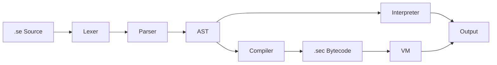

<div align="center">
  
</div>

<div align="center">
  
</div>

<p align="center">
  <a href="https://git.io/typing-svg">
    
  </a>
</p>

<div align="center">
  
  
  
</div>

<div align="center">
  <br>
  
  
</div>

---

<h2 align="center">📖 About seng</h2>

**seng** (Simple English) is a programming language designed so that even non-programmers can read, write, and understand code. Its syntax is plain English, focusing on the **logic** of your thoughts rather than the **syntax** of the machine.

<details open>
<summary><b>🌎 Mission & Vision</b></summary>
<br>

- **🧩 Ideology**: Programming is a human right. We focus on computational thinking without abstract symbol barriers.
- **🎯 Mission**: Zero-friction entry point into software development for educators and self-learners.
- **🔭 Vision**: Natural language as the global standard for introductory programming and AI automation.
- **💻 Supported Platforms**: Windows 🪟 & Linux 🐧
</details>

---

<h2 align="center">🚀 Quick Start</h2>

```sh
# Start an interactive REPL
seng repl

# Run a source file directly (automatically uses _secache if up-to-date)
seng hello.se

# Compile to bytecode (stored in _secache/ folder)
seng compile hello.se

# Run compiled bytecode explicitly
seng run examples/_secache/hello.sec
```

---

<h2 align="center">🛠️ Language Reference</h2>

<details>
<summary><b>📝 Basics (Variables, Printing, Input)</b></summary>

```seng
# Variables
set name to "Alice"
set age to 25

# Printing
say "Hello, " + name

# Input
ask yourName for "What is your name? "
say "Hello, " + yourName
```
</details>

<details>
<summary><b>🔢 Arithmetic & Logic</b></summary>

```seng
set x to 10 plus 5        # 15
set x to 4 * 6            # 24
set x to 17 mod 3         # 2

if age is greater than 18 and age is less than 65 then
    say "Adult"
end
```
</details>

<details>
<summary><b>🔁 Control Flow (Loops & If)</b></summary>

```seng
# If / Else
if score is greater than 90 then
    say "A grade"
else
    say "Try harder"
end

# Repeat Loop
repeat 5 times
    say "Hello!"
end

# While Loop
while count is less than 10
    set count to count plus 1
end

# For-Each Loop (v1.1.0+)
for each fruit in ["Apple", "Banana", "Cherry"] then
    say "I like " + fruit
end
```
</details>

<details>
<summary><b>📦 Collections (Lists & Dictionaries)</b></summary>

```seng
# Lists
make list fruits
add "Apple" to fruits
say item 1 of fruits
# List literal
set myItems to ["A", "B", "C"]

# Dictionaries
make dictionary user
set item "name" of user to "Bob"
set item "age" of user to 40
say item "name" of user
# Dictionary literal
set config to {"theme": "dark", "version": 1.1}
```
</details>

<details>
<summary><b>🏗️ Object-Oriented Programming (Blueprints)</b></summary>

```seng
blueprint Person
    has name
    has age
    hidden has secret

    define init with n and a
        set me of name to n
        set me of age to a
        set me of secret to "hush!"
    end

    define greet
        say "Hello, I am " + me of name
    end
end

instance of Person called alice with "Alice" and 30
call greet of alice
```
</details>

<details>
<summary><b>🛡️ Error Handling</b></summary>

```seng
try
    throw "Something went wrong!"
catch err
    say "Caught error: " + err
end
```
</details>

---

<h2 align="center">📚 Standard Library</h2>

SENG comes with a robust set of built-in packages:

- **math** — `sqrt`, `sin`, `cos`, `random`, `pi`, `floor`, `ceil`, `abs`, `power`, `min`, `max`, `round`.
- **sys** — `args()`, `exit()`, `sleep()`, `time_ms()`, `timestamp()`, `env_get()`, `run_cmd()`.
- **json** — `json_parse()`, `json_stringify()`, `json_get()`, `json_has()`, `json_keys()`.
- **string** — `upper()`, `lower()`, `trim()`, `contains()`, `starts_with()`, `ends_with()`, `replace()`, `split()`, `join()`, `format()`.
- **type** — `type_of()`, `to_str()`, `to_num()`, `is_num()`, `is_str()`, `is_bool()`, `is_list_val()`, `is_nothing()`.
- **io** — `read_file()`, `write_file()`, `append_file()`, `delete_file()`, `rename_file()`, `file_exists()`, `dir_exists()`, `make_dir()`, `list_dir()`.
- **time** — `now()`, `format_time()`.
- **http** — `http_get()`, `http_post()`, `http_post_json()`, `http_put()`, `http_delete()`.

---

<h2 align="center">🏗️ Architecture & Implementation</h2>



### Execution Models
1. **Tree-walk Interpreter**: Directly executes the AST. Best for rapid development and debugging.
2. **Bytecode VM**: Compiles source to a custom binary format (`.sec`) and executes it on a high-performance stack-based virtual machine.

---

<h2 align="center">💖 Support & Sponsorship</h2>

If you find **seng** useful and would like to support the maintainers, you can sponsor us via Patreon. Your support helps us keep the project alive and growing!

<p align="center">
  <a href="https://www.patreon.com/cw/NOCORPS?utm_medium=unknown&utm_source=join_link&utm_campaign=creatorshare_creator&utm_content=copyLink">
    
  </a>
</p>

> [!IMPORTANT]
> **Patreon Connected**: Sponsorships for **@NOCORPS** are managed via `kanagaraj.developer@gmail.com`. 
> Please note that sponsorships made on Patreon will no longer receive recognition badges on GitHub, but they are deeply appreciated and directly fund the development of NoCorps projects.

---

<h2 align="center">🤝 Contributors</h2>

<p align="center">
  <a href="https://github.com/KANAGARAJ-M">
    
    <br />
    <sub><b>KANAGARAJ M</b></sub>
  </a>
</p>


---

<div align="center">
  
</div>

<p align="center">
  <i>seng v1.1.0 — NoCorps.org</i>
</p>
